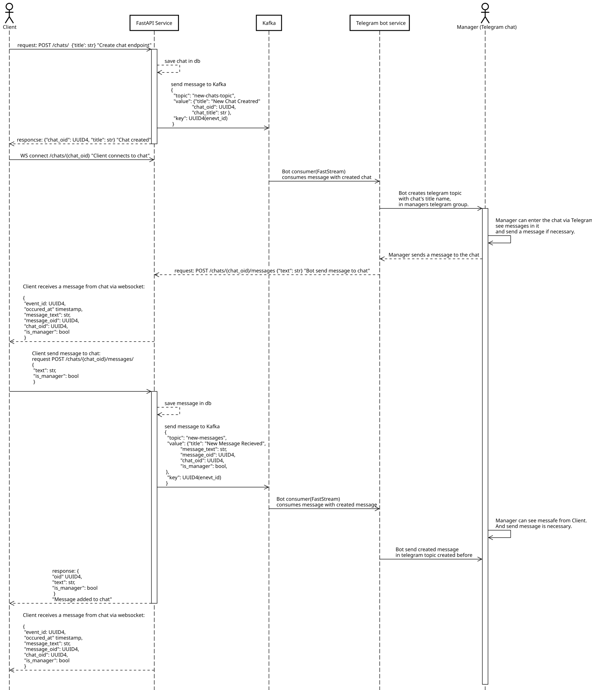

# Support Chat Service 
- ### A service that processes user requests to technical support
## Here UML Sequence Diagram of basic usecase
- Client send message to Manager 
- Manager answer to Client via telegram
- Client recieve messages via websocket



## Requirements

- [Docker](https://www.docker.com/get-started)
- [Docker Compose](https://docs.docker.com/compose/install/)
- [GNU Make](https://www.gnu.org/software/make/)
- [POETRY](https://python-poetry.org/)

## How to Run

1. **Clone the repository:**

   ```bash
   git clone https://github.com/pelkoa-glitch/fastapi-chat.git
2. Install all required packages in `Requirements` section.

3. Rename and fill the file `.env.example` with your dependencies

4. Run command
    ```bash
        cd fastapi-chat -  go to project folder
        poetry install  -  install dependencies
        poetry shell    -  activate python venv
        make all        -  run all containers

5. Api docs on http://localhost:8000/api/docs

### Implemented Commands

* `make app` - up app container
* `make app-logs` - follow the logs in app container
* `make app-down` - down app container
* `make shell` - open command line in app's container
* `make all` - up all containers
* `make all-down` - down all containers
* `make purge` - down all ciontainers and delete all volumes
* `make test` - run tests in app container

6. Make shure, after FastAPI service is running, to up Telegram service.
'''https://github.com/pelkoa-glitch/support-glitch-bot'''